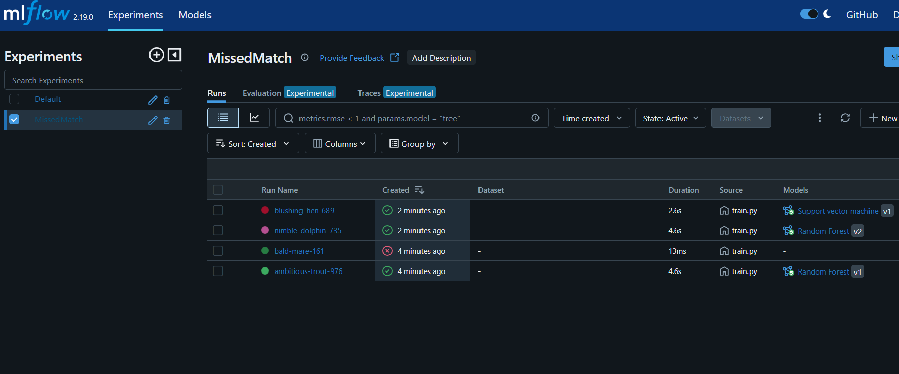

**Missed Match app**
 
# **Abstract**
 
> Missed Match is a predictive application designed to address the
> challenge of patient no-shows in healthcare systems. Leveraging a
> dataset from Kaggle containing over 100,000 medical appointment
> records, the app uses machine learning to predict whether a patient
> will attend their scheduled appointment based on factors such as age,
> gender, appointment day, and medical history. The project involved
> comprehensive data preprocessing, exploratory data analysis, and the
> development of a predictive model using advanced machine learning
> techniques. The final model was integrated into a user-friendly web
> application built with Streamlit and hosted on the Streamlit Cloud. To
> ensure robust performance tracking, MLflow was employed to monitor key
> metrics and save model artifacts. Missed Match aims to assist
> healthcare providers in optimizing appointment scheduling, reducing
> no-show rates, and improving resource allocation.
 
# **Introduction**
 
> In the healthcare industry, missed appointments (no-shows) are a
> significant issue that leads to wasted resources, increased costs, and
> disrupted schedules for both patients and providers. According to
> recent studies, no-show rates can range from 10% to 30%, depending on
> the region and type of healthcare service. Addressing this problem is
> critical to improving operational efficiency and ensuring that
> patients receive timely care.
>
> Missed Match is a data-driven solution designed to tackle this
> challenge. By analyzing historical appointment data, the application
> predicts the likelihood of a patient missing their appointment,
> enabling healthcare providers to take proactive measures such as
> sending reminders, rescheduling, or overbooking. The project leverages
> a publicly available dataset from Kaggle, which includes details such
> as patient demographics, appointment scheduling, and medical history.
> Through a combination of data preprocessing, exploratory analysis, and
> machine learning modeling, Missed Match provides actionable insights
> to healthcare professionals.
>
> This report outlines the development process of Missed Match,
> including the data preprocessing steps, the creation of the predictive
> model, and the deployment of the application using Streamlit and
> MLflow. The goal is to demonstrate how data science and machine
> learning can be applied to solve real-world problems in the healthcare
> sector.
 
# **Background**
 
> The problem of patient no-shows has been a persistent challenge in
> healthcare systems worldwide. No-shows not only lead to inefficiencies
> but also result in financial losses for healthcare providers and
> delayed care for patients. Traditional approaches to reducing
> no-shows, such as manual reminders and overbooking, have shown limited
> success. With the advent of data science and machine learning, there
> is an opportunity to address this issue more effectively by leveraging
> predictive analytics.
>
> The dataset used in this project, sourced from Kaggle, contains
> information on over 100,000 medical appointments in Brazil. It
> includes features such as patient ID, appointment ID, gender, age,
> appointment day, scheduled day, and whether the patient attended the
> appointment. Additionally, the dataset provides insights into factors
> such as hypertension, diabetes, alcoholism, and whether the patient
> received a reminder SMS. These features were used to build a
> predictive model that identifies patterns associated with no-shows.
>
> The development of Missed Match involved several key steps:
 
- Data Preprocessing: Cleaning the dataset, handling missing values, and
  encoding categorical variables to prepare the data for analysis.
 
- Exploratory Data Analysis (EDA): Visualizing trends and correlations
  in the data to identify key factors influencing no-shows.
 
- Model Development: Training and evaluating machine learning models to
  predict no-shows, with a focus on accuracy and interpretability.
 
- Application Deployment: Building a web application using Streamlit to
  provide an intuitive interface for users and hosting it on the
  Streamlit Cloud.
 
- Performance Monitoring: Using MLflow to track model performance
  metrics and save artifacts for reproducibility.
 
> By combining these elements, Missed Match offers a scalable and
> efficient solution to the no-show problem, empowering healthcare
> providers to make data-driven decisions and improve patient outcomes.
 
# **Methodology**
 
## **Software requirements**
 
> The development of Missed Match relied on a set of software tools and
> libraries to ensure efficient data processing, model development, and
> application deployment. The primary tools used in this project
> include:
 
- Visual Studio Code (VS Code): A versatile integrated development
  environment (IDE) used for writing, testing, and debugging the Python
  code.
 
- Python: The core programming language for data preprocessing,
  analysis, and model development.
 
- Streamlit: A Python library used to create the web application
  interface, allowing users to interact with the predictive model in a
  user-friendly manner.
 
- MLflow: A platform for managing the machine learning lifecycle,
  including tracking model performance metrics, logging experiments, and
  saving model artifacts.
 
> These tools provided a robust foundation for building and deploying
> the Missed Match application, ensuring scalability, reproducibility,
> and ease of use. Further details about the software development tools
> and their specific roles will be discussed in the subsequent sections.
 
## **Software development methods**
 
### **Software development strategies**
 
> The development of Missed Match followed the Agile methodology, a
> flexible and iterative approach that emphasizes collaboration,
> adaptability, and continuous improvement. Agile was particularly
> well-suited for this project as it allowed the team to break down the
> development process into smaller, manageable tasks (sprints), ensuring
> that each component of the application---data preprocessing, model
> development, and deployment---was thoroughly tested and refined.
> Regular feedback loops and iterative updates ensured that the final
> product met the project's objectives effectively. This approach also
> facilitated seamless integration of new features, such as multi-page
> functionality in the Streamlit app and real-time performance
> monitoring using MLflow.
 
### **Software development tools and version controlling**
 
> The development of Missed Match leveraged a variety of tools and
> libraries to ensure efficiency, scalability, and reproducibility.
> Below is an overview of the key tools and their roles in the project:
>
> Streamlit: This Python library was used to create the web application
> interface. The app features three main pages:
>
> **Home:** Provides an overview of the project and its purpose.
>
> **Prediction:** Allows users to input patient data and receive
> predictions on whether the patient will attend their appointment.
>
> **Analysis:** Displays visualizations and insights derived from the
> dataset.
>
> Streamlit's simplicity and flexibility made it an ideal choice for
> building an interactive and user-friendly interface.
>
> **SQLite3:** Instead of relying on static CSV files, the project used
> SQLite3 to create a database (MissedMatch.db) for storing and managing
> the dataset. This approach made the project more realistic and
> automated, enabling efficient data retrieval and manipulation during
> both development and deployment.
>
>
>
>
>
> **Streamlit Cloud:** The application was hosted on Streamlit Cloud,
> which provided a seamless deployment experience. To ensure security
> and controlled access, the app was configured to be private, with
> authentication settings allowing only authorized users to view and
> interact with it (as shown in the auth.png image).
>
>
>
> **MLflow:** This tool was used to track and monitor the performance of
> the machine learning model. MLflow allowed the team to log
> experiments, save model artifacts, and monitor key performance
> metrics, ensuring reproducibility and transparency throughout the
> model development process.
>
>
>
> **Python Libraries for EDA and AI Model Creation:**
>
> Exploratory Data Analysis (EDA): Libraries such as Pandas, NumPy, and
> Matplotlib were used for data cleaning, analysis, and visualization.
> These tools helped identify patterns and trends in the dataset, which
> informed the feature selection and model development process.
>
> **AI Model Creation:** Scikit-learn was used to build and evaluate the
> predictive model. The library's extensive suite of algorithms and
> tools enabled the team to experiment with different models and select
> the one with the best performance.
>
> **Version Control:** Git and GitHub were used for version control
> throughout the project. The team created different branches for
> specific tasks (e.g., diagrams,testing workflow, model training, app
> development), allowing for parallel development and easy
> collaboration. After thorough testing and review, changes were merged
> into the main branch. This workflow ensured that the codebase remained
> organized and that all team members were working with the latest
> version of the project (as shown in the source control.png image).
>
>
>
 
## **Software testing**
 
> To ensure the reliability and functionality of the Missed Match
> application, a robust testing process was implemented using GitHub
> Actions. GitHub Actions enabled the team to automate testing
> workflows, ensuring that the application was thoroughly tested after
> each pull request. This approach helped identify and resolve issues
> early in the development cycle, maintaining the stability and quality
> of the codebase.
>
> Testing Workflow
>
> The testing workflow was defined in a python-app.yml file, which
> outlined the steps to be executed automatically whenever changes were
> pushed to the repository or a pull request was made. Key steps in the
> workflow included:
>
> **Set up Job:** Initializing the testing environment
>
> **Checkout Code:** Pulling the latest version of the code from the
> repository using actions/checkout@v4.
>
> **Set up Python:** Configuring the Python environment (version 3.10)
> to ensure compatibility.
>
> Install Dependencies: Installing all required Python libraries and
> dependencies listed in the project's requirements.txt file.
>
> **Lint with Flake8:** Running Flake8 to check the code for syntax
> errors, style inconsistencies, and potential bugs.
>
> **Run Tests:** Executing unit tests and integration tests to validate
> the functionality of the application.
>
> The workflow ensured that any issues, such as failed tests, were
> flagged immediately, allowing the team to address them before merging
> changes into the main branch. This automated testing process
> significantly reduced the risk of introducing bugs into the production
> environment and streamlined the development workflow.
>
> Workflow Results
>
> The results of each test run were displayed in the GitHub Actions
> interface, providing detailed insights into the success or failure of
> each step. For example, the test_workflow.png image shows a successful
> build, where all steps, including dependency installation, were
> completed without errors. This visual feedback helped the team monitor
> the health of the codebase and maintain high standards of code quality
> throughout the project.
>
>
>
> By leveraging GitHub Actions for automated testing, the team ensured
> that the Missed Match application was robust, reliable, and ready for
> deployment at every stage of development.
 
## **Software organization and functionalities**
 
> The Missed Match application uses a modular design with Streamlit for
> a multi-page interface (Home, Prediction, Analysis). Key components
> include user authentication, SQLite3 for accessing data base and
> MLflow for model tracking.
>
>UML Class Diagram
>
>
>
>UML Sequence Diagram
>
>
>
>
 
## **MLOps approaches**
 
> The Missed Match application adopts an MLOps approach to streamline
> model development, deployment, and monitoring. This ensures
> reliability, scalability, and reproducibility.
 
### **Model Development & Registration** 
 
> Once the predictive model is built, we register it using MLflow to
> track experiments and store artifacts. This allows us to monitor model
> performance and compare different models effectively. In our case, we
> focus on Random Forest and Support Vector Machine (SVM) since their
> results are quite similar. To evaluate their effectiveness, we use key
> metrics such as:
 
- Accuracy
 
- F1 Score
 
- Mean Absolute Error (MAE)
 
- Mean Squared Error (MSE)

>
>
>
> By storing models in MLflow, we ensure all training runs are logged
> and can be retrieved for comparison or further tuning.
 
### **Model Comparison & Performance Monitoring** 
 
> To make informed decisions about model selection, we use MLflow's
> parallel coordinates plot, which visualizes multiple performance
> metrics. As shown in Figure 1, this helps us analyze trade-offs
> between accuracy, F1 score, and error metrics.
 
### **Artifact Management**
 
> MLflow allows us to store model artifacts, including trained models,
> hyperparameters, and logs. This ensures that every experiment remains
> reproducible and that we can deploy the best-performing model when
> needed.
>
>
>
 
### **Database Integration & Model Retraining** 
 
> To keep our predictions relevant, we connect the model to a SQLite3
> database. Each time the model runs, it fetches the latest data from
> the database, ensuring it is always trained on up-to-date patient
> records. SQLite3 is a lightweight Python library that simplifies data
> management without requiring a separate database server.
>
>
>
 
### **Automated Experiment Tracking**
 
> With MLflow tracking, we log essential details such as:
 
- Hyperparameters
 
- Training duration
 
- Dataset versions
 
- Model performance metrics
 
> This setup enables continuous monitoring and ensures that the
> best-performing model is always identified and ready for deployment.
 
# **Results**
 
> To illustrate the functionality of the application, we provide
> screenshots of the key pages:
 
- Home Page: Contains an overview and description of the project.
 
- Prediction Page: Allows users to input patient data and test the
  model's predictions.
 
- Analysis Page: Displays data visualizations and graphs of the
  preprocessed data, aiding in understanding trends and model
  performance.
 
> These pages showcase the usability and effectiveness of the system in
> predicting patient no-shows and providing insights for healthcare
> providers.
 
# **Discussion & Conclusion**
 
> This project successfully implements an MLOps pipeline for predictive
> modeling in healthcare.
 
## **What we have achieved**
 
- A structured workflow for model development, tracking, and deployment.
 
- Integration of MLflow for monitoring model performance.
 
- A database-linked retraining approach for continuous model
  improvement.
 
- A user-friendly web app to interact with the model and view insights.
 
## **Future Enhancements**
 
> Despite these achievements, several improvements remain:
 
- Authentication System: Implementing Streamlit Auth for secure user
  access.
 
- Containerization: Deploying the project using AWS EC2 or Docker for
  scalability.
 
- Enhanced Testing Workflows: Increasing automation in testing for more
  robust performance.
 
- Model Improvements: Experimenting with additional models and
  optimization techniques to further improve accuracy and reliability.
 
> By continuing to develop these areas, we aim to enhance Missed Match
> into a fully scalable and deployable solution that maximizes impact in
> real-world healthcare settings.
